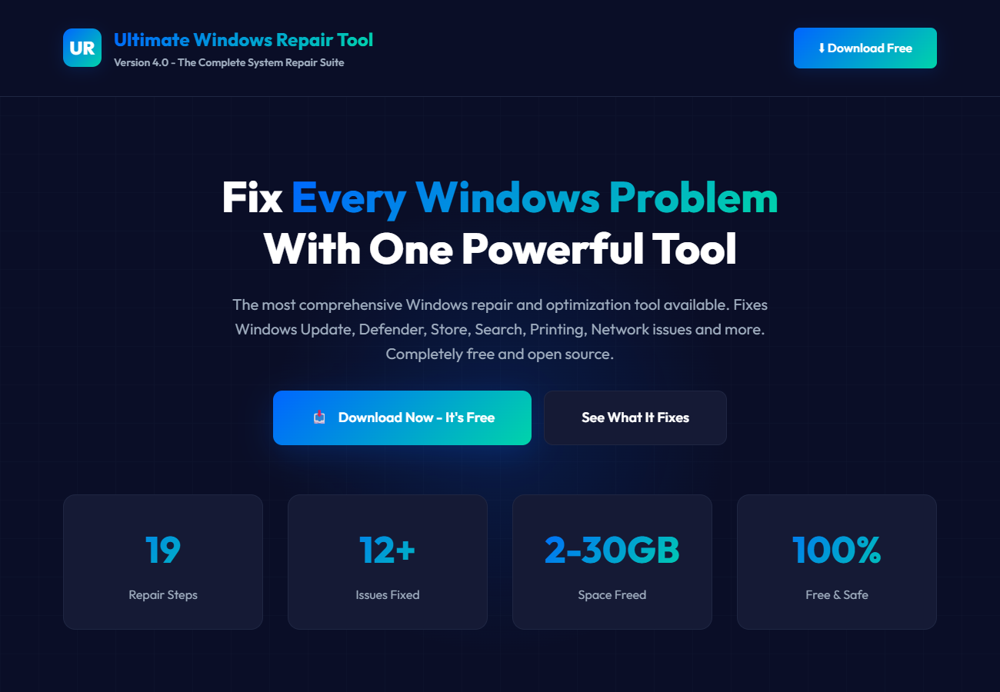

# Windows Repair Tool

A free, one-script **Windows repair and optimization tool** with visual progress. It fixes the classic "Windows Update won't work" problem and then goes further: re-enables Windows Update and Defender if they were disabled, resets the Store and Print Spooler, repairs system files, cleans up gigabytes of junk and reports before/after performance.

> Built by a working IT technician after one too many stuck-update service calls. Free to use, free to change.

## Screenshots


*The bundled overview page (docs/index.html)*

## What it does

**Full mode** (~45-60 minutes):

1. **Re-enable disabled features** - Windows Update and Microsoft Defender (registry and service fixes)
2. **Optimize and fix** - startup program analysis, Windows Store reset and app re-registration, search index rebuild, Print Spooler reset, .NET Framework repair, disk health check, deep network adapter reset
3. **Deep cleanup** - `Windows.old`, temp files, browser cache (saved passwords are kept), component store cleanup, error reports and dumps
4. **System repairs** - DISM image repair and SFC scan
5. **Windows Update reset** - stop services, clear caches, re-register 36 critical DLLs, reset network settings (DNS, Winsock, proxy, IP)
6. **Performance metrics** - before/after comparison

A **System Restore Point** is created first (unless you skip it).

**Quick mode** (~8-12 minutes): essential fixes only - re-enable Update/Defender, Store and Spooler reset, update service reset, cache clearing, DLL re-registration, network reset, check for updates.

## Quick start

1. Download or clone this repo.
2. Double-click **`START-HERE.bat`** (full repair) or **`START-QUICK-MODE.bat`** (quick fixes). Both ask for Administrator rights.

Or from an elevated PowerShell:

```powershell
powershell -ExecutionPolicy Bypass -File .\Reset-WindowsUpdate-Clean.ps1          # full
powershell -ExecutionPolicy Bypass -File .\Reset-WindowsUpdate-Clean.ps1 -Quick   # quick
```

Switches: `-Quick`, `-SkipRestorePoint`, `-SkipRepairs` (skip DISM/SFC), `-SkipCleanup`.

## Safety

This script stops services, deletes update caches and old Windows files, re-registers system DLLs and resets networking. It is designed to be safe, but:

- Save your work first - a network reset can drop remote sessions
- Keep the restore point (do not use `-SkipRestorePoint` on machines you can't afford to break)
- Use it only on computers you own or are authorised to service. No warranty - see [LICENSE](LICENSE)

`docs/index.html` is a stand-alone, printable overview page you can open in any browser.

## Contributing

Ideas and pull requests welcome - see [CONTRIBUTING.md](CONTRIBUTING.md) and [ROADMAP.md](ROADMAP.md).

## License

[MIT](LICENSE) (c) 2026 Ronald Goodchild / REGTeches
